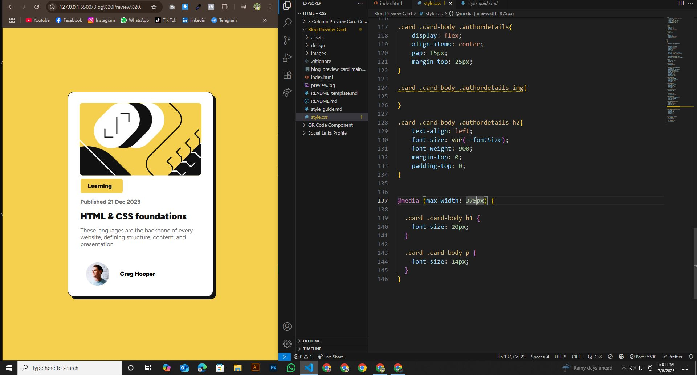

# Frontend Mentor - Blog Preview Card Challenge

This is a solution to the [Blog Preview Card Challenge](https://www.frontendmentor.io/challenges/qr-code-component-iux_sIO_H) on [Frontend Mentor](https://www.frontendmentor.io/challenges/qr-code-component-iux_sIO_H). Frontend Mentor challenges help me improve my coding skills by building realistic projects.

## Table of contents

- [Overview](#overview)
  - [Screenshot](#screenshot)
  - [Project Links](#links)
- [My Process](#my-process)
  - [Built with](#built-with)
  - [What I learned](#what-i-learned)
  - [Continued development](#continued-development)
  - [Useful resources](#useful-resources)
- [Author](#author)
- [Acknowledgments](#acknowledgments)


## Overview

### Screenshot





### Links

- Solution URL: (https://github.com/hemal6325/Blog-Preview-Card-Challenge/)
- Live Site URL: (https://hemal6325.github.io/Blog-Preview-Card-Challenge/)

## My Process
I built this project using HTML and CSS, focusing on layout design and responsive styling. Through it, I learned Flexbox, Semantic Markup, and how to create visually balanced components.

### Built With

- HTML5 Semantic Structure
- CSS3 Custom Properties
- Flexbox
- Mobile First Workflow


### What I Learned

During this experience, I gained valuable skills and deeper understanding of the subject. It helped me improve my problem-solving abilities and boosted my confidence in applying new concepts.


```css
:root{
    --primaryFont: "Figtree", sans-serif;
    --fontSize: 16px;

    --Yellow: hsl(47, 88%, 63%);
    --White: hsl(0, 0%, 100%);
    --Gray500: hsl(0, 0%, 42%);
    --Gray950: hsl(0, 0%, 7%);
}

*,
*::after,
*::before{
    margin: 0;
    padding: 0;
    list-style: none;
    box-sizing: border-box;
}

html, body{
    height: 100%;
}

body{
    background: var(--Yellow);
    display: flex;
    justify-content: center;
    align-items: center;
}

h1,
h2,
h3,
h4,
h5,
h6{
    font-family: var(--primaryFont);
}

.card{
    background: var(--White);
    justify-content: center;
    align-items: center;
    text-align: center;
    padding: 14px;
    width: 400px;
    border-radius: 15px;

    border: 1px solid var(--Gray950);
    box-shadow: 8px 8px 0px var(--Gray950);
    transition: all 0.2s ease-in-out;
}

.card:hover{
    transform: translate(-4px, -4px);
    box-shadow: 12px 12px 0px var(--Gray950);
}

.card img{
    border-radius: 25px;
    padding: 15px;
}

.card .card-body{
    text-align: left;
    padding-left: 20px;
}

.card .card-body span{
    font-family: var(--primaryFont);
    font-weight: 900;
    color: var(--Gray950);
    background-color: var(--Yellow);
    font-size: var(--fontSize);
    padding: 10px 30px 10px 30px;
    border: none;
    border-radius: 5px;
    text-align: left;
    padding-left: 20px;
    margin-top: 20px;
    margin-bottom: 20px;
}

.card .card-body h6{
    color: var(--Gray500);
    font-size: var(--fontSize);
    margin-top: 25px;
    margin-bottom: 15px;
    text-align: left;
}

.card .card-body h1{
    color: var(--Gray950);
    font-size: 25px;
    font-weight: 900;
    margin-bottom: 15px;
    text-align: left;
}

.card .card-body h1:hover{
    color: var(--Yellow);
    font-weight: 900;
}

.card .card-body a{
    list-style: none;
    text-decoration: none;
}

.card .card-body p{
    font-family: var(--primaryFont);
    font-size: var(--fontSize);
    color: var(--Gray500);
    text-align: left;
}

.card .card-body .authordetails{
    display: flex;
    align-items: center;
    gap: 15px;
    margin-top: 25px;
}

.card .card-body .authordetails img{
    
}

.card .card-body .authordetails h2{
    text-align: left;
    font-size: var(--fontSize);
    font-weight: 900;
    margin-top: 0;
    padding-top: 0;
}


@media (max-width: 375px) {

  .card .card-body h1 {
    font-size: 20px;
  }

  .card .card-body p {
    font-size: 14px;
  }
}

```

### Continued Development

I would like to make my own QR Generator so this could be used as a default template. The qr code could be links to a document or something along those ways. Going to think about something useful that could come in handy.

### Useful Resources

- [FLEXBOX FROGGY](https://flexboxfroggy.com/) - This helped me to understand better how to use flexbox.


## Author

- Frontend Mentor - [@hemal6325](https://www.frontendmentor.io/profile/hemal6325)
- GitHub Profile - [@hemal6325](https://github.com/hemal6325/)

## Acknowledgments


At some point i was a little stuck with setting the style for the image. And i solved this problem using online Resources, ChatGPT & Google Bard.


**Have Fun Building!** 🚀
